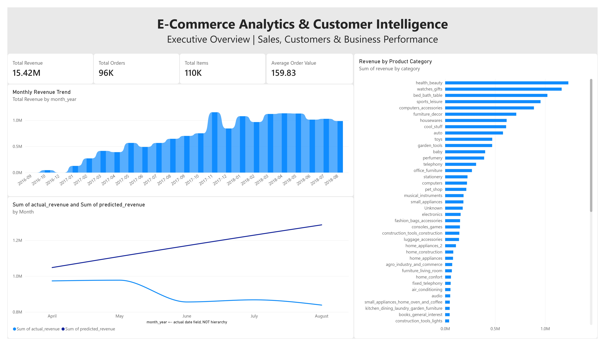
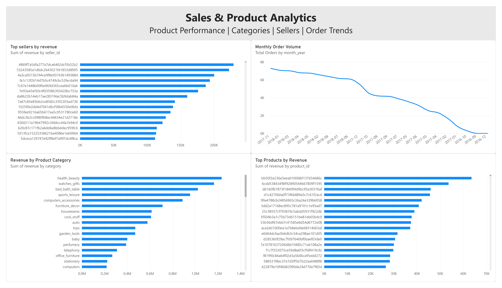
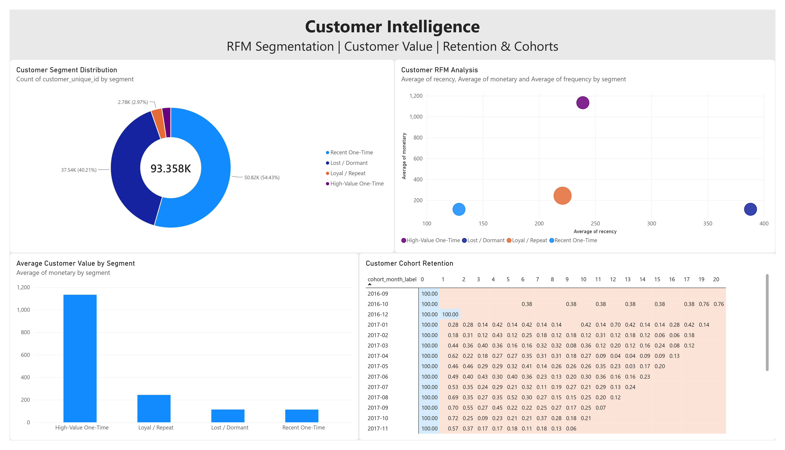
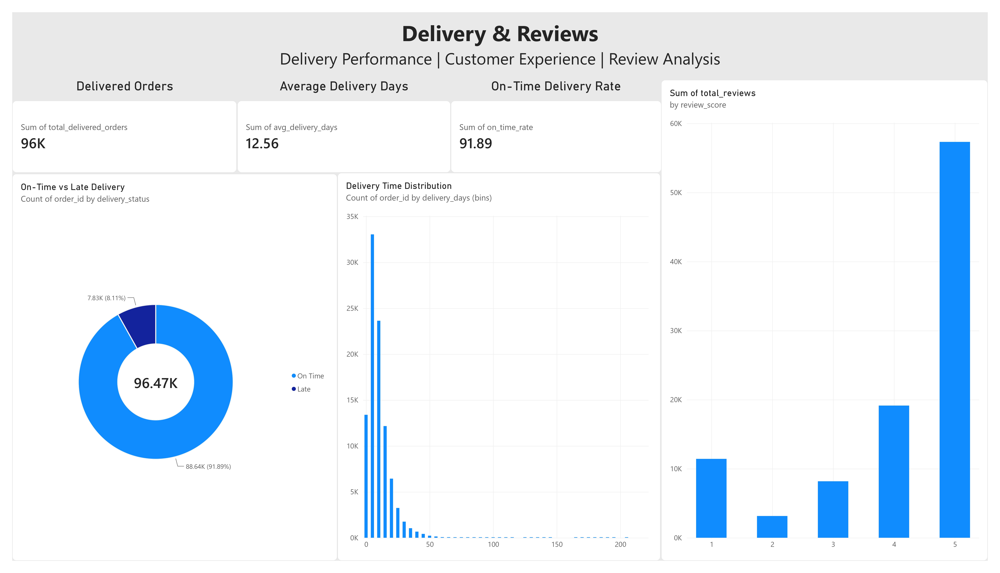

# E-Commerce Analytics & Customer Intelligence


An end-to-end e-commerce analytics project that transforms raw transactional data into actionable business insights using **PostgreSQL, SQL, Python, Machine Learning, and Power BI**.

---

## Project Overview

This project analyzes an e-commerce marketplace dataset to understand:

- Sales and revenue performance
- Product and category trends
- Customer purchasing behavior
- Customer segmentation
- Customer retention patterns
- Delivery performance
- Customer satisfaction
- Revenue forecasting

The project follows a complete analytics pipeline:

```
Raw Data
   |
   v
PostgreSQL Database
   |
   v
SQL Data Transformation
   |
   +----------------------+
   |                      |
   v                      v
Python Analytics       Power BI Dashboard
   |
   v
Machine Learning Models
```

---

# Tech Stack

## Database
- PostgreSQL
- SQL
- Views
- Window Functions
- Data Aggregation
- Analytical Queries

## Data Analysis & Machine Learning

- Python
- Pandas
- NumPy
- Matplotlib
- Scikit-learn

Machine Learning techniques:

- RFM Customer Analysis
- K-Means Customer Segmentation
- Revenue Forecasting

## Visualization

- Microsoft Power BI

---

# Project Structure

```
ecommerce-analytics/

│
├── python/
│   ├── notebooks/
│   └── scripts/
│
├── sql/
│   ├── schema/
│   ├── views/
│   └── analysis/
│
├── powerbi/
│   └── ecommerce_analytics_dashboard.pbix
│
├── INSIGHTS.md
├── README.md
└── .gitignore
```

---

# Data Pipeline

## 1. Data Storage

Raw e-commerce data is loaded into PostgreSQL.

The database contains transactional information related to:

- Customers
- Orders
- Products
- Sellers
- Payments
- Reviews
- Delivery information

---

## 2. SQL Analytics Layer

SQL was used to create analytical views for Power BI.

Major transformations include:

- Revenue calculation
- Monthly sales aggregation
- Product performance analysis
- Seller ranking
- Customer RFM features
- Cohort analysis
- Delivery KPIs

---

## 3. Python Machine Learning

Python was used for advanced analytics.

### Customer Segmentation

Customer behavior was analyzed using RFM features:

- Recency
- Frequency
- Monetary Value


K-Means clustering identified four customer groups:

- Recent One-Time
- Lost / Dormant
- Loyal / Repeat
- High-Value One-Time


### Revenue Forecasting

A revenue forecasting model was developed using historical monthly revenue patterns.

The model was evaluated using a chronological holdout approach.

---

# Power BI Dashboard

The dashboard contains four analytical pages.

---

## Dashboard Preview

### Executive Overview



### Sales & Product Analytics



### Customer Intelligence



### Delivery & Reviews



## Page 1: Executive Overview

Provides a high-level business view:

- Total Revenue
- Total Orders
- Total Items
- Average Order Value
- Monthly Revenue Trend
- Revenue by Product Category
- Actual vs Predicted Revenue


---

## Page 2: Sales & Product Analytics

Focuses on product and marketplace performance:

- Revenue by Product Category
- Top Products by Revenue
- Monthly Order Volume
- Top Sellers by Revenue


---

## Page 3: Customer Intelligence

Analyzes customer behavior:

- Customer Segment Distribution
- Customer Value Analysis
- RFM Customer Analysis
- Customer Cohort Retention


---

## Page 4: Delivery & Reviews

Analyzes operational performance:

- Delivered Orders
- Average Delivery Days
- On-Time Delivery Rate
- Delivery Time Distribution
- Customer Review Scores


---

# Key Business Insights

## 1. Customer Retention Opportunity

The majority of customers are one-time buyers or dormant customers.

Only a small percentage of customers demonstrate repeat purchasing behavior.

### Recommendation

Focus on:

- Personalized recommendations
- Retention campaigns
- Re-engagement strategies


---

## 2. High-Value Customer Opportunity

High-value customers generate significantly higher monetary value compared with other customer groups.

### Recommendation

Target these customers using:

- VIP campaigns
- Personalized offers
- Loyalty programs


---

## 3. Category Performance

Health & Beauty is one of the strongest revenue-generating categories.

### Recommendation

Use category-level insights for:

- Inventory planning
- Marketing campaigns
- Seller strategy


---

## 4. Delivery Performance

The marketplace demonstrates strong delivery performance with a high percentage of orders delivered on time.

### Recommendation

Further analyze:

- Late deliveries by seller
- Regional delivery issues
- Product-level delays


---

## 5. Forecasting Model Improvement

The forecasting model captured historical patterns but showed limitations when revenue trends changed.

### Recommendation

Future improvements:

- Advanced time-series models
- Additional lag features
- Machine learning forecasting approaches


---

# Future Improvements

Potential improvements for this project:

- Build automated ETL pipelines
- Deploy dashboards using cloud platforms
- Add real-time analytics
- Improve forecasting accuracy
- Add customer recommendation systems


---

# Author

**Nishant Kumar**

